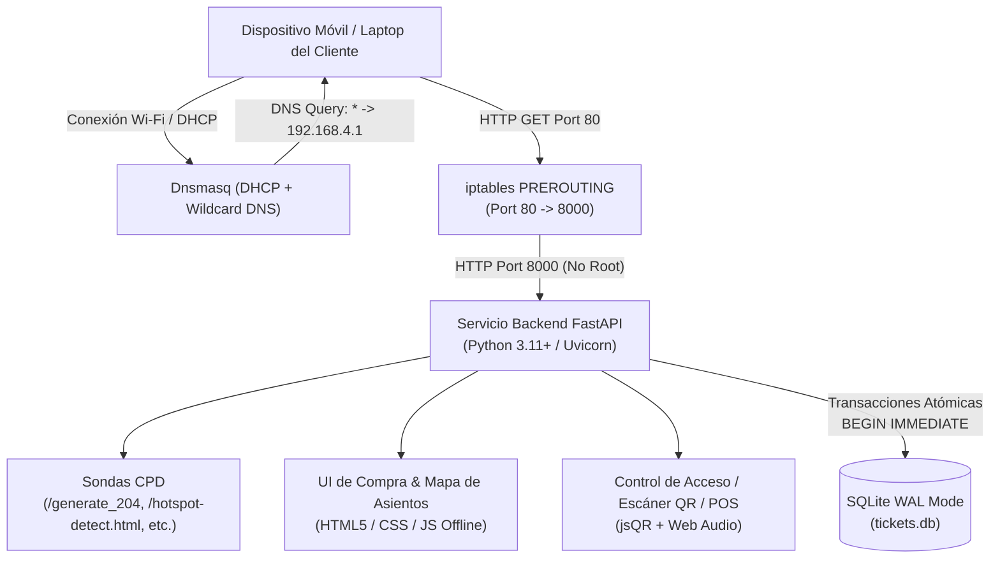

# Local Ticketing & Captive Portal System

Un sistema autónomo e integral de **Punto de Venta (POS), Emisión de Boletos y Portal Cautivo Local**, diseñado para operar 100% desconectado de internet en un equipo host conectado por Ethernet o Wi-Fi a un router local aislado.

---

## 1. Características Principales

* **Intercepción Automática de Clientes (Portal Cautivo / CPD):**
  * Responde a las sondas de detección de conectividad de los principales sistemas operativos (Android `/generate_204`, Apple iOS/macOS `/hotspot-detect.html`, Windows `/ncsi.txt` y `/connecttest.txt`, Firefox/Linux).
  * Redirección HTTP comodín (*Catch-All*) para cualquier petición GET/HEAD no reconocida hacia el portal de venta.
* **Cero Sobrevendidos (Garantía de Aislamiento Transaccional):**
  * SQLite configurado en modo WAL (`PRAGMA journal_mode=WAL;`) con `PRAGMA busy_timeout=10000;`.
  * Transacciones atómicas explícitas (`BEGIN IMMEDIATE`) y actualizaciones condicionales optimistas:
    ```sql
    UPDATE tickets 
    SET status = 'SOLD', buyer_name = :name, buyer_contact = :contact, qr_hash = :hash 
    WHERE id = :ticket_id AND status = 'AVAILABLE';
    ```
  * Verificado con pruebas de estrés concurrentes multi-hilo (25 hilos simultáneos disputando inventario limitado sin duplicados).
* **Firma Criptográfica y Generación de Códigos QR:**
  * Códigos QR generados localmente como SVG embebido o Base64 PNG.
  * Firma HMAC-SHA256 para prevenir falsificaciones en entornos offline.
* **Panel de Administración y Control de Acceso (Puerta):**
  * Escáner QR en vivo utilizando la cámara del dispositivo móvil/laptop (biblioteca `jsQR` 100% offline, sin dependencias CDN).
  * Soporte para lectores de código de barras/QR USB o ingreso manual.
  * Prevención de re-ingreso / fraude de doble entrada: Si un boleto ya fue marcado como `USED`, emite una alerta roja y sonido de advertencia.
  * Punto de Venta Rápido (POS) para taquilla en puerta.
  * Métricas en tiempo real: ingresos, boletos vendidos, validados y disponibles.
* **100% Autónomo y Offline:**
  * Cero dependencias en la nube o fuentes externas (CSS, JavaScript, sintetizador de audio Web Audio API, SVGs locales).

---

## 2. Arquitectura del Sistema



---

## 3. Estructura del Proyecto

```
venta-wifi/
├── app/
│   ├── config.py             # Configuración del sistema y variables de entorno
│   ├── database.py           # Conexión SQLite con WAL, busy_timeout y pragmas
│   ├── models.py             # Modelos SQLAlchemy (Event, Ticket, Transaction)
│   ├── schemas.py            # Modelos Pydantic v2 para validación de API
│   ├── security.py           # Firma criptográfica HMAC-SHA256
│   ├── qr_service.py         # Generador de códigos QR (SVG, PNG, Data URI)
│   ├── routers/
│   │   ├── captive.py        # Sondas de detección de portal cautivo (Android/Apple/Windows)
│   │   ├── events.py         # Catálogo de eventos y mapas de asientos interactivos
│   │   ├── tickets.py        # Compra atómica y renderizado de boletos digitales
│   │   ├── admin.py          # Validación en puerta, métricas en vivo y creación de eventos
│   │   └── catchall.py       # Redirección comodín para navegación no autenticada
│   ├── static/
│   │   ├── css/style.css     # Estilos responsivos, interfaz de boletos y @media print
│   │   └── js/
│   │       ├── app.js        # Lógica del cliente, selector de asientos y compra
│   │       ├── admin.js      # Lógica de taquilla, escáner de cámara y audio sintetizado
│   │       └── jsqr.min.js   # Biblioteca jsQR 100% offline para lectura de cámara
│   └── templates/
│       ├── base.html         # Plantilla base con indicadores de estado offline
│       ├── index.html        # Portal cautivo / catálogo de entradas
│       ├── ticket.html       # Vista del boleto imprimible con QR y firma de seguridad
│       └── admin.html        # Panel de administración, POS y escáner
├── network/
│   ├── dnsmasq.conf.template # Plantilla declarativa para DHCP y DNS comodín
│   └── dnsmasq.conf          # Configuración generada para la interfaz de red
├── scripts/
│   ├── setup_network.sh      # Script de configuración de IP, iptables y dnsmasq (requiere sudo)
│   ├── teardown_network.sh   # Script de limpieza y restauración de red (requiere sudo)
│   ├── seed_data.py          # Inicializador con eventos de demostración y boletos
│   └── run_portal.sh         # Lanzador del servicio web FastAPI en el puerto 8000
├── systemd/
│   ├── ticketing-portal.service # Unidad systemd para el backend de usuario
│   └── dnsmasq-portal.service   # Unidad systemd para el orquestador de red
├── tests/
│   ├── test_captive.py       # Pruebas automatizadas de sondas CPD y catch-all
│   ├── test_concurrency.py   # Pruebas de estrés y garantía de cero sobreventas
│   └── test_tickets.py       # Ciclo de vida de boletos, QR y prevención de doble entrada
├── requirements.txt          # Dependencias de Python
├── main.py                   # Punto de entrada de la aplicación FastAPI
└── README.md
```

---

## 4. Instalación y Puesta en Marcha

### Requisitos Previos
* Sistema Operativo: Linux (Debian, Ubuntu, Raspberry Pi OS).
* Python 3.11+ con soporte para `venv`.
* Herramientas de red: `dnsmasq`, `iptables`, `iproute2`.

```bash
sudo apt update
sudo apt install -y python3 python3-venv dnsmasq iptables
```

### Paso 1: Configurar el Entorno Virtual de Python
```bash
python3 -m venv venv
./venv/bin/pip install -r requirements.txt
```

### Paso 2: Inicializar la Base de Datos con Datos de Prueba
```bash
./venv/bin/python scripts/seed_data.py
```

### Paso 3: Ejecutar las Pruebas Automatizadas
Verifica la integridad de las sondas cautivas, las firmas criptográficas y el aislamiento contra sobreventas:
```bash
PYTHONPATH=. ./venv/bin/pytest -v
```

### Paso 4: Iniciar el Backend (Como usuario normal)
El backend corre en el puerto `8000` (sin privilegios de root):
```bash
./scripts/run_portal.sh
```

---

## 5. Orquestación de Red y Portal Cautivo (Producción / Router Aislado)

Para que el servidor intercepte a los dispositivos clientes que se conectan al Wi-Fi o router:

### Configurar Interfaz de Red y Redirección (Requiere privilegios root)
Ejecuta el script indicando la interfaz de red conectada al router o hotspot (por ejemplo `eth0` o `wlan0`):
```bash
sudo ./scripts/setup_network.sh wlan0 192.168.4.1
```

Este script realiza automáticamente:
1. Asigna la IP estática `192.168.4.1/24` a la interfaz.
2. Habilita el reenvío de paquetes IPv4 en el kernel (`net.ipv4.ip_forward=1`).
3. Crea la regla en iptables NAT PREROUTING:
   ```bash
   iptables -t nat -A PREROUTING -i wlan0 -p tcp --dport 80 -j REDIRECT --to-ports 8000
   ```
4. Genera `network/dnsmasq.conf` configurando:
   * Rango DHCP: `192.168.4.50` a `192.168.4.200`.
   * Puerta de enlace y DNS principal: `192.168.4.1`.
   * Resolución comodín: `address=/#/192.168.4.1`.
5. Inicia el demonio `dnsmasq`.

### Desmontar la Red (Teardown)
Para restablecer las reglas de firewall y detener dnsmasq al terminar el evento:
```bash
sudo ./scripts/teardown_network.sh wlan0 192.168.4.1
```

---

## 6. Endpoints y Funcionamiento de las Sondas Cautivas

| Sistema Operativo | URL de Sonda | Respuesta del Servidor | Efecto en el Cliente |
| :--- | :--- | :--- | :--- |
| **Android** | `/generate_204`, `/gen_204` | `HTTP 302` a `http://192.168.4.1/` | Notificación del sistema "Acceder a la red Wi-Fi" |
| **Apple iOS / macOS** | `/hotspot-detect.html` | `HTTP 302` a `http://192.168.4.1/` | Se abre automáticamente la ventana del Captive Network Assistant (CNA) |
| **Windows** | `/ncsi.txt`, `/connecttest.txt` | `HTTP 302` a `http://192.168.4.1/` | El globo del área de notificación invita a iniciar sesión |
| **Cualquier Navegador** | `GET /sitio-web-externo.html` | `HTTP 302` a `http://192.168.4.1/` | Intercepción transparente y redirección al portal de compra |

---

## 8. Despliegue con Docker y Docker Compose

Todo el sistema (FastAPI, SQLite WAL, Dnsmasq, reglas iptables y portal cautivo) está completamente containerizado y puede levantarse con un solo comando.

### Consideraciones Clave para Contenedores Cautivos
Un portal cautivo y servidor DHCP dentro de Docker requiere dos configuraciones de red fundamentales:
1. **`network_mode: "host"`**:
   El protocolo DHCP emite paquetes de difusión en capa 2 (broadcast UDP puertos 67 y 68). La red estándar tipo `bridge` de Docker aísla este tráfico del hardware físico. Con `host`, el contenedor se enlaza directamente a la tarjeta Wi-Fi (`wlan0`) o Ethernet (`eth0`).
2. **`cap_add: [ "NET_ADMIN", "NET_RAW" ]`**:
   Permite al contenedor gestionar la redirección de puertos en `iptables` (puerto 80 $\rightarrow$ 8000) y asignar la IP del gateway sin necesidad de privilegios completos de root en el host.

### Puesta en Marcha Rápida con Docker Compose

1. **Editar las variables de red en `docker-compose.yml` (opcional):**
   Asegúrate de que `INTERFACE` coincida con tu tarjeta de red conectada al router (`wlan0`, `eth0`, etc.):
   ```yaml
   environment:
     - INTERFACE=wlan0
     - HOST_IP=192.168.4.1
   ```

2. **Construir e Iniciar el Contenedor:**
   ```bash
   sudo docker compose up --build -d
   ```

3. **Verificar los Logs del Contenedor:**
   ```bash
   sudo docker compose logs -f
   ```

4. **Detener el Contenedor y Restaurar Reglas:**
   ```bash
   sudo docker compose down
   ```
   El script de entrada intercepta automáticamente `SIGTERM` y limpia las reglas de `iptables` y el proceso `dnsmasq`.

