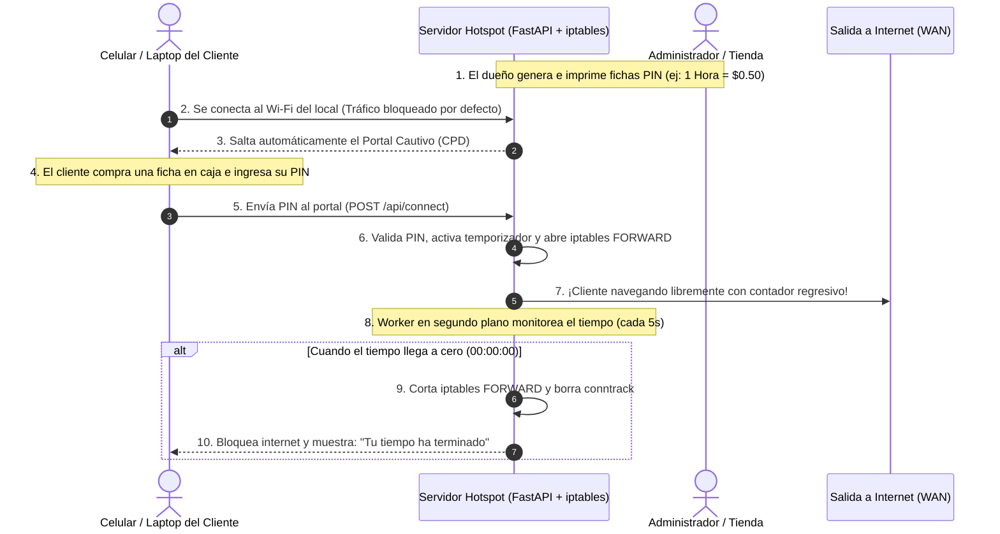

# Sistema de Venta de Acceso a Internet Wi-Fi (Hotspot Billing & Portal Cautivo)

Un sistema autónomo e integral para **vender acceso a internet por tiempo mediante fichas (PINs / Vouchers)**, control de ancho de banda y corte automático de conexión al finalizar el tiempo contratado.

Ideal para cyber-cafés, plazas comerciales, hoteles, residencias, terminales o comunidades donde se desea compartir/revender una conexión a internet de forma controlada y monetizada.

---

## 1. ¿Cómo Funciona el Negocio y el Flujo de Usuario?



---

## 2. Características Principales

* **Control de Acceso Dinámico por Firewall:**
  * Por defecto, los clientes recién conectados **NO tienen acceso a internet** (la cadena `FORWARD` de iptables descarta su tráfico hacia la WAN).
  * Al ingresar un PIN válido o activar una prueba gratis, el sistema inserta dinámicamente reglas en `iptables` autorizando la IP/MAC del dispositivo específico.
  * Cuando el tiempo contratado expira, un worker en segundo plano **revoca el acceso de inmediato** y corta las conexiones activas (`conntrack`), devolviendo al usuario al portal cautivo.
* **Portal Cautivo Responsivo con Contador Regresivo en Vivo:**
  * Intercepción automática en **Android** (`/generate_204`), **Apple iOS/macOS** (`/hotspot-detect.html`), **Windows** (`/ncsi.txt`) y cualquier navegador web.
  * Muestra el tiempo restante en formato `HH:MM:SS` sincronizado con el servidor.
  * Permite **recargar más tiempo** (ingresar otro PIN para sumar minutos a la sesión activa sin desconectarse).
  * Opción de **Prueba Gratuita (Free Trial)** de 5 minutos por dirección MAC (para que el cliente verifique la velocidad antes de pagar).
* **Panel de Administración para el Dueño del Negocio (`/admin`):**
  * **Generador e Impresión de Fichas (Vouchers):** Genera lotes de 10, 20 o 50 fichas e imprime hojas con tarjetas recortables de bolsillo listas para vender en caja. Cada tarjeta incluye el PIN, duración, precio y un código QR para autoconectarse al escanearlo con la cámara.
  * **Monitoreo de Dispositivos Conectados en Tiempo Real:** Lista de celulares/laptops navegando ahora mismo, IP, MAC, tiempo restante en vivo, botón para regalar tiempo (`+15 min`, `+1 hora`) o **"Desconectar"** (cortar internet manualmente).
  * **Gestión de Tarifas y Planes:** Configuración de planes personalizados (ej: 15 min, 1 hora, 3 horas, 1 día, 1 semana).
  * **Métricas de Ganancias:** Total de fichas vendidas y dinero recaudado.

---

## 3. Estructura del Proyecto

```
venta-wifi/
├── app/
│   ├── config.py              # Configuración de interfaces (WAN/Hotspot), IP y tarifas
│   ├── database.py            # SQLite optimizado con modo WAL y timeout
│   ├── firewall.py            # Módulo de control de iptables (autorizar / revocar internet)
│   ├── models.py              # Modelos: Plan, Voucher (Ficha), Session, Sale, TrialRecord
│   ├── schemas.py             # Validación de solicitudes API con Pydantic v2
│   ├── qr_service.py          # Generación de códigos QR para las fichas recortables
│   ├── services/
│   │   └── session_manager.py # Lógica de activación de PINs, recargas y expiración
│   ├── routers/
│   │   ├── portal.py          # Portal del cliente (canje de PIN, prueba gratis, estado)
│   │   ├── admin_hotspot.py   # Panel de control, generador de fichas y monitoreo
│   │   ├── captive.py         # Sondas de detección para Android, iOS y Windows
│   │   └── catchall.py        # Redirección comodín para tráfico no autenticado
│   ├── static/
│   │   └── css/style.css      # Estilos offline responsivos
│   └── templates/
│       ├── portal.html        # Interfaz del cliente (contador regresivo y canje de PIN)
│       ├── admin_hotspot.html # Panel del administrador y monitoreo en vivo
│       └── print_vouchers.html# Plantilla de fichas recortables de bolsillo
├── scripts/
│   ├── setup_network.sh       # Configura iptables NAT, bloqueo de reenvío y dnsmasq
│   ├── teardown_network.sh    # Restaura la red y elimina reglas de iptables
│   ├── seed_data.py           # Crea planes por defecto y fichas de prueba iniciales
│   └── run_portal.sh          # Inicia el backend en el puerto 8000
├── docker/
│   └── entrypoint.sh          # Orquestador del contenedor Docker
├── docker-compose.yml         # Despliegue con Docker Compose
├── Dockerfile                 # Imagen Docker con dnsmasq, iptables y Python
├── tests/
│   ├── test_captive.py        # Pruebas de intercepción de portal cautivo
│   └── test_hotspot_billing.py# Pruebas de canje de PIN, recarga y expiración
├── requirements.txt
├── QUICKSTART.md              # Guía rápida para retomar el proyecto
└── main.py                    # Entrada principal con worker de expiración en segundo plano
```

---

## 4. Cómo Probarlo sin Tocar tu Wi-Fi ni Perder Internet (Modo Simulación / Desarrollo)

Puedes probar el 100% de la lógica (canje de PINs, contador regresivo en vivo, aviso de tiempo agotado, generador de fichas recortables y panel de administración) en tu computadora sin desconectarte del Wi-Fi de tu casa:

1. **Inicia el servidor:**
   ```bash
   ./scripts/run_portal.sh
   ```
2. **Abre el Portal de Cliente:**
   👉 `http://localhost:8000`
   * Ingresa el PIN demo `123456` o `654321` (vienen precargados con 1 hora cada uno).
   * Verás cómo se activa la conexión y el reloj regresivo empieza a descontar segundos.
   * Si ingresas el PIN `777888` mientras estás conectado, verás cómo se recargan 3 horas adicionales a tu sesión.
3. **Abre el Panel de Administrador:**
   👉 `http://localhost:8000/admin`
   * Verás tu dispositivo conectado en la tabla en vivo.
   * Puedes regalarle `+15m`, `+1h` o presionar **"Desconectar"**.
   * Ve a la pestaña **"Generador de Fichas"** y genera 20 fichas de 1 hora.
   * Haz clic en **"🖨️ Abrir Plantilla de Impresión de Fichas"** para ver las tarjetas recortables listas para imprimir.

---

## 5. Puesta en Marcha en Producción (Gateway Real con Salida a Internet)

Para ponerlo a operar en un router físico o negocio real donde la computadora recibe internet por un cable/interfaz y reparte a los clientes por Wi-Fi:

1. **Identifica tus interfaces de red:**
   * Interfaz con Internet (WAN): Ej. `eth0`
   * Interfaz hacia los clientes (Hotspot/AP): Ej. `wlan0`
2. **Ejecuta el script de red como root:**
   ```bash
   # Sintaxis: sudo ./scripts/setup_network.sh <interfaz_clientes> <interfaz_internet> [ip_gateway]
   sudo ./scripts/setup_network.sh wlan0 eth0 192.168.4.1
   ```
3. **Inicia el backend:**
   ```bash
   ./scripts/run_portal.sh
   ```
4. **Al terminar el día (o para desactivar):**
   ```bash
   sudo ./scripts/teardown_network.sh wlan0 eth0 192.168.4.1
   ```

---

## 6. Despliegue con Docker

Si prefieres levantarlo con Docker Compose:
```bash
# Construir y levantar
sudo docker compose up --build -d

# Ver registros en tiempo real
sudo docker compose logs -f

# Detener el servicio
sudo docker compose down
```

---

## 7. Ejecución de Pruebas Automatizadas

Para validar que las sondas de detección de sistemas operativos y la expiración de tiempo funcionen al 100%:
```bash
PYTHONPATH=. ./venv/bin/pytest -v
```
*(12 pruebas aprobadas).*
